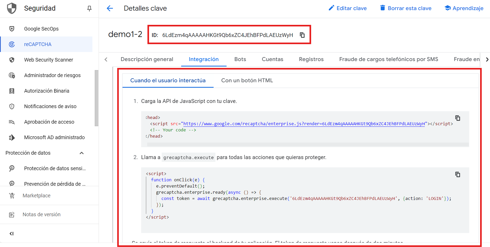
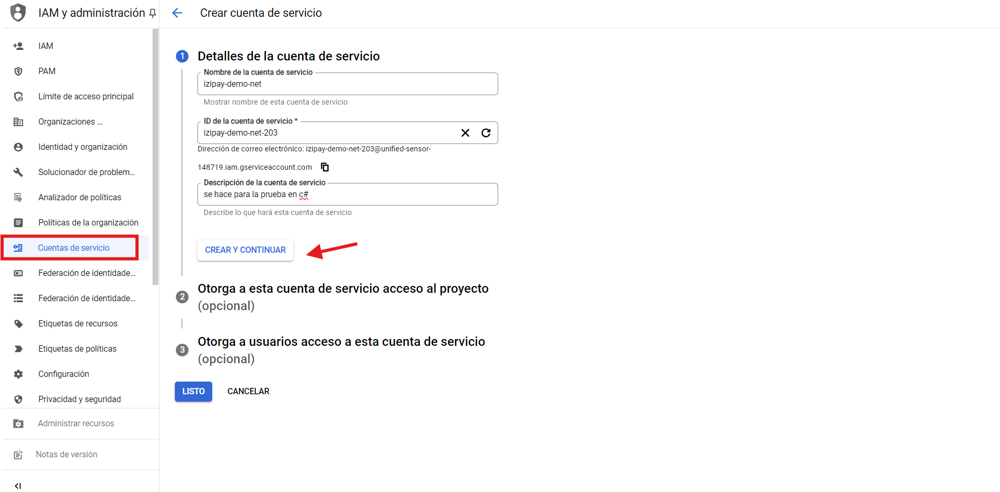
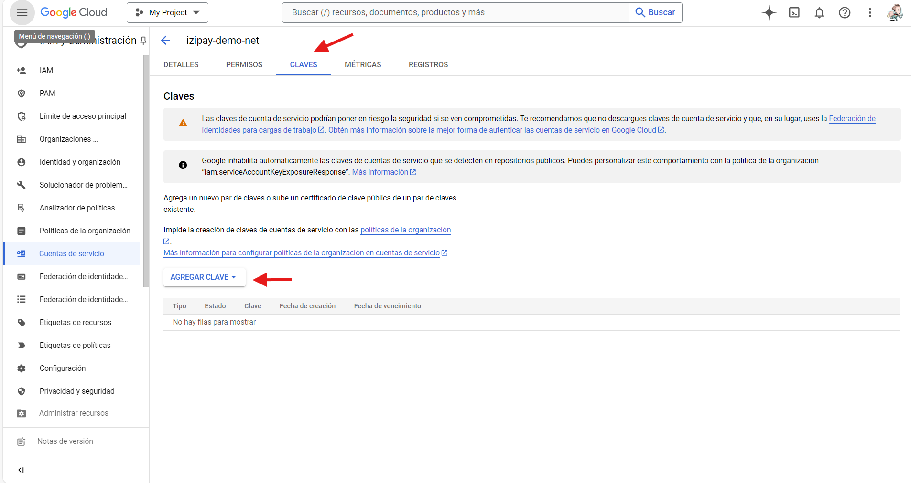

# Documentación: Implementación MFA con reCAPTCHA Enterprise

Esta guía detalla cómo implementar un desafío de autenticación multifactor (MFA) utilizando reCAPTCHA Enterprise en una aplicación web. El objetivo es desafiar al usuario para realizar una verificación adicional en el caso de que la evaluación determine la necesidad de mayor seguridad.

## Tabla de Contenidos

### Equipo de Infraestructura

1. [Requisitos Previos](#requisitos-previos)
2. [Configuración de reCAPTCHA Enterprise](#configuración-de-recaptcha-enterprise)
   - [Crear el Proyecto en Google Cloud](#1-crear-el-proyecto-en-google-cloud)
   - [Configurar reCAPTCHA Enterprise](#2-configurar-recaptcha-enterprise)
   - [Visualización de la Cuota del Servicio](#4-visualización-de-la-cuota-del-servicio)
   - [Documentación Oficial del Servicio reCAPTCHA](#5-documentación-oficial-del-servicio-recaptcha)

## Equipo de Infraestructura

### Requisitos Previos

1. Acceso a Google Cloud Platform con permisos para gestionar y configurar reCAPTCHA Enterprise.
2. Llaves de reCAPTCHA Enterprise obtenidas en el panel de configuración de reCAPTCHA Enterprise en Google Cloud.

### Configuración de reCAPTCHA Enterprise

#### 1. Crear el Proyecto en Google Cloud
   - Accede a [Google Cloud Console](https://console.cloud.google.com/).
   - Crea un proyecto o selecciona uno existente.

#### 2. Configurar reCAPTCHA Enterprise
   - En el menú de navegación, ve a **reCAPTCHA Enterprise**.
   - Configura un **sitio web** y obtén las claves necesarias:
     - **SITE_ID**: ID de la clave de reCAPTCHA configurada.
     - **Secret Key** (para el backend en caso de verificaciones).
     
     

#### 3. Creación de Cuenta de Servicio
Para configurar reCAPTCHA Enterprise en tu backend, es necesario crear una cuenta de servicio en Google Cloud. Sigue estos pasos:

1. **Crear una Cuenta de Servicio:**

- Accede a la consola de Google Cloud y navega a la sección de IAM & Admin.
- Selecciona Cuentas de servicio y haz clic en Crear cuenta de servicio.

2. **Paso 1: Nombre y ID de la Cuenta de Servicio:**

- Proporciona un nombre y un ID para la cuenta de servicio. Este paso es obligatorio.
3. **Paso 2: Asignar un Rol:**

- Asigna el rol de reCAPTCHA a la cuenta de servicio. Este paso es obligatorio.
4. **Paso 3: Opcional:**

- Este paso es opcional y puedes omitirlo si no necesitas configuraciones adicionales.
5. **Generar y Descargar la Clave:**

- Una vez creada la cuenta de servicio, aparecerán unos tabs en la parte superior.
- Selecciona la opción Claves.

- Haz clic en Agregar clave y selecciona Crear clave nueva en formato JSON.

- Descarga el archivo JSON, ya que se usará para la configuración en el backend.

#### 4. Configuración de la Autenticación de Varios Factores (MFA)
**Paso 1: Configurar remitente:**
   - En la consola de Google Cloud, ve a la página de reCAPTCHA Enterprise.
   - En el panel de Autenticación de Varios Factores, haz clic en Configurar.
   - Habilita la verificación por correo electrónico y proporciona el nombre y correo electrónico del remitente.   
   - [Mas detalles](https://console.cloud.google.com/security/recaptcha/settings?hl=es-419&project=unified-sensor-148719)
   
   
**Paso 2: Configurar dns:**
   Si no se hizo una configuración con su DNS siga los siguientes pasos:
   - Ir al link: 
   
   

### Visualización de la Cuota del Servicio
   Para visualizar la cuota del servicio de reCAPTCHA Enterprise, accede al siguiente enlace:
   - [Cuota de reCAPTCHA Enterprise](https://console.cloud.google.com/apis/api/recaptchaenterprise.googleapis.com/quotas?hl=es&project=unified-sensor-148719)
   - [Precios de reCAPTCHA Enterprise](https://cloud.google.com/security/products/recaptcha?hl=es-419#pricing)

### Documentación Oficial del Servicio reCAPTCHA
   Para más detalles y documentación oficial del servicio reCAPTCHA, visita el siguiente enlace:
   - [Documentación Oficial de reCAPTCHA](https://cloud.google.com/recaptcha-enterprise/docs)
   - [Flujo de reCAPTCHA](https://cloud.google.com/recaptcha/docs/overview?hl=es-419)

